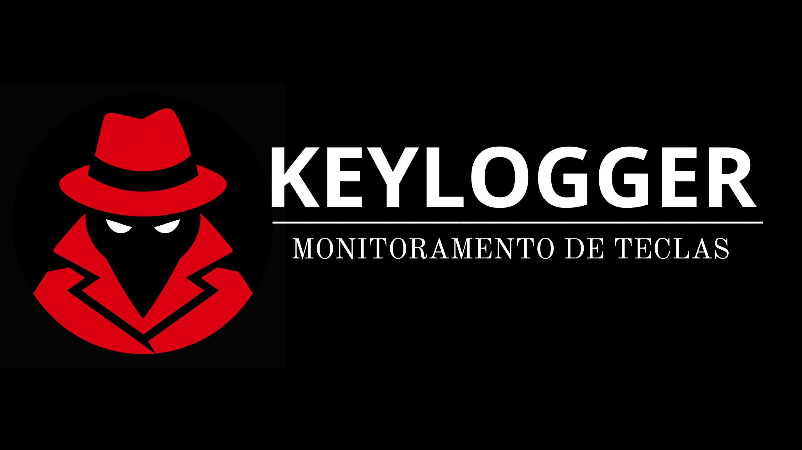

[](https://www.python.org/)
[](https://www.gnu.org/licenses/gpl-3.0.en.html)
[](#)
[](#)
[](#)

## 📌 Tutorial de Configuração

Siga os passos abaixo para configurar o keylogger:

### 1️⃣ Instalar as dependências

Execute no terminal:

```bash
pip install pynput
pip install secure-smtplib
````

### 🔑 Criar a senha do app no Gmail

1. Acesse: [Senhas de App do Google](https://myaccount.google.com/apppasswords)  
2. Selecione **Mail** e **Other (Personalizado)**  
3. Gere a senha e copie

### 3️⃣ Configurar seu script

No arquivo Python, substitua os campos com `*****` pelas suas informações:

```python
EMAIL_REMETENTE = "************@gmail.com"  # Substitua pelo seu e-mail
SENHA_APP = "************"                     # Substitua pela senha do app
EMAIL_DESTINO = "*****************@gmail.com"     # Para onde os logs serão enviados
````

### 💻 Opcional: Converter o keylogger em .exe

Se você quiser criar um executável do seu keylogger para Windows, pode usar o **PyInstaller**:

1. Instale o PyInstaller:

```bash
pip install pyinstaller
````

2. Navegue até a pasta do script e execute:

```bash
pyinstaller --onefile --noconsole main.py
````

3. Após a conclusão, o executável estará disponível na pasta dist/.
